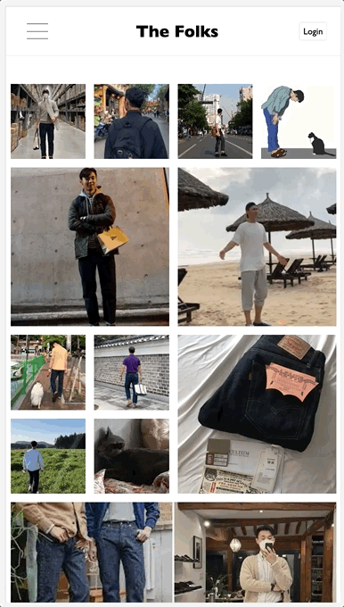
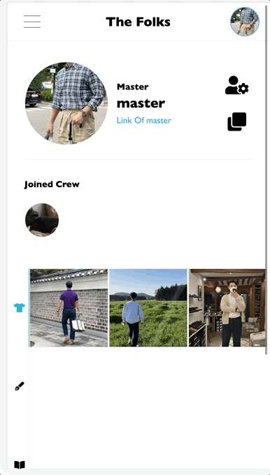
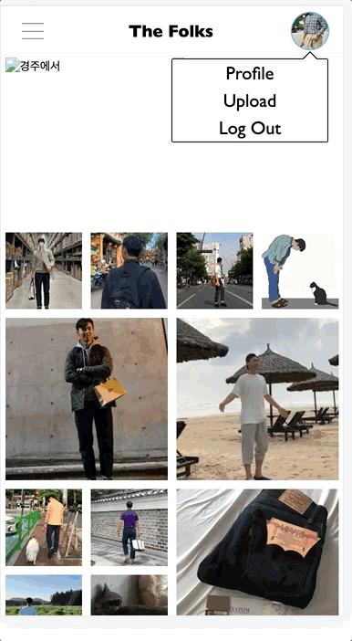
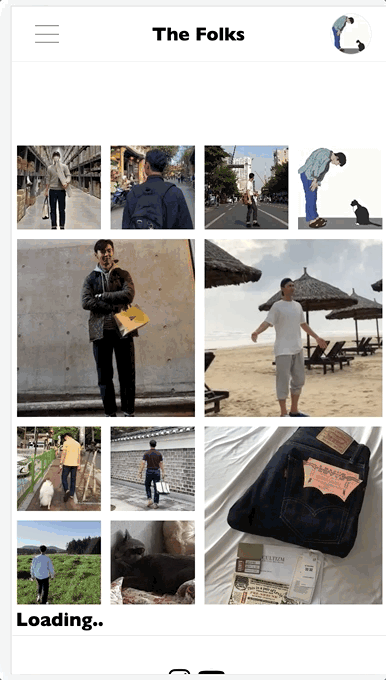
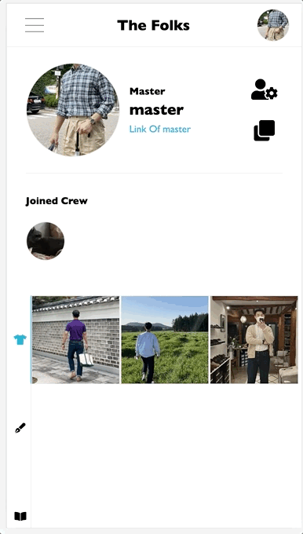

# [The Folks](http://www.the-folks.com/)

## Description

- The Advanced Fashion Community를 지향하는 웹을 만들고 있습니다.

## UI/UX

### 로그인

### 마이페이지

### 게시글

### 댓글

### 크루 만들기

### 크루 세부페이지

## Tech Stack

### FE

- Next js
- Apollo Client
- SCSS

### ETC

- AWS EC2, S3

## Specification

- USER

  - [x] 회원가입
  - [x] 이메일 인증
  - [x] 비밀번호 찾기
  - [x] 로그인, 로그아웃
  - [x] 개인정보(닉네임, 개인 링크, 비밀번호, 프로필사진, 프로필 배경사진) 변경
  - [x] 개인 페이지 카테고리(OOTD, Column, Review)징 된 포스트
  - [x] Follow한 크루 리스트
  - [x] 개인 작성한 게시글 전체보기

- POST

  - [x] 카테고리에 따른 게시글 CRUD
  - [x] 임시 게시글 CRUD
  - [x] 댓글 CRUD

- CREW

  - [x] 크루 개별 페이지
  - [x] 크루 개별 정보(링크(Instagram, Youtube, ETC), 이름, 프로필사진, 프로필 배경사진) 변경
  - [x] 팔로우한 회원 리스트
  - [x] 유저가 크루 팔로우 하기
  - [x] 팔로우한 유저 크루 내 등급 변경
  - [x] 팔로우한 유저의 등급에 따른 관련 포스팅(OOTD 카테고리 한정) 보여주기
  - [x] 일정 등급이상의 회원 크루 생성

- BRAND (개발 보류 - 테스트 코드 우선)

  - [ ] 브랜드 개별 페이지
  - [ ] 브랜드 개별 정보(링크(Instagram, Youtube, ETC), 이름, 프로필사진, 프로필 배경사진) 변경
  - [ ] 크루와 연결 시스템

- Main Page

  - [x] Index
    - [x] Infinite Scroll 기능
  - [x] Talks
    - [x] Infinite Scroll 기능
  - [x] Column
    - [x] Infinite Scroll 기능
  - [x] CREW
    - [x] Infinite Scroll 기능
  - [ ] Brand
    - [ ] Infinite Scroll 기능

- [ ] Unit Test Code
- [ ] Integration Code
